## Design Focus and Problem Space
I wanted to use this assignment focus on redesigning the Class Search page on SIS. As Class Search is one of the primary ways for students to find classes and make their schedule, I wanted to see what I can do to improve the experience
### Primary Users
Class Search is a page on SIS that is used by every student (both undergraduate and graduate) to help register classes. This page is used to find classes to either add them to your cart or register them directly. 
### Brief Overview of the Key Problems
_Note:This will be discussed in more detail in the Contextual Theory_

Currently SIS has a very Class Search tab that contains three different types of search: basic, advanced and multi-school. While these search options make it easy to distinguish based on logistic factors such as location and department, there tend to some problems I've noticed:
- Class Search options are very limited and contain very few filters that are actually useful to students.
- Also, once clicking "Search", there is little to no functionality supported to ordering your classes or to futher filter the options. 
- Finally, unlike most search engines, Class Search only works well if you know what your looking for. That means if you are a new student or a current student trying to find class about certain topics but don't know the class name or class id, then you are mostly out of lucky(more on this later). 

## Contextual Theory
To conduct this, I've asked one of my neighbors(who I will refer as the subject for privacy) who is currently starting his college experience. This is perfect as he hasn't used SIS before and would be an example of a incoming student who doesn't have an exact idea of all the classes available and all the location of all the filters.
_Due to Privacy Reasons, I can not include a video of the Contextual Inquiry session_

### Task 1: Finding Only Writing Intensive Classes
The subject was asked to navigate to the the "Class Search" tab. As there are few classes in Spring 2021, the subject was asked to click on Fall 2021. The subject was then asked to search for writing intensive classes only. The first thing the subject did was write "Writing Intensive" in the "Class Title" and then searched. However as that produced nothing, he clicked back and then just clicked search without typing anything. I asked him why did he type nothing, and he said he thought that will show all classes. Then on the search page, he saw all classes and noticed the "Writing Intensive" column. He tried clicking on the column, however nothing happened and he then looked at the left side to see if there was an option. After a few minutes of clicking different places, he by accident clicked back and then said that "Basic search failed, let's try Advanced Search". Then he noticed immediately the "Writing Intensive Option" and clicked on that and searched.

_Key Takeaways_
- New users to Class Search do not immediately think to go to advanced search (in general the two additional search tabs were not used unless necessary)
- Something as important (and as we can seen as basic) as Writing Intensive was added to the advanced search and there was no clear way to change that 

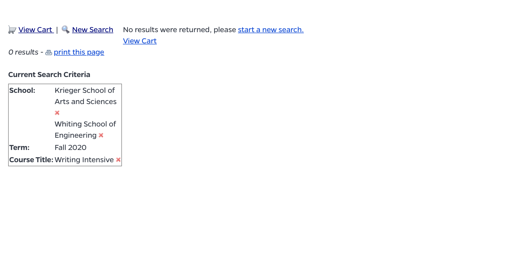  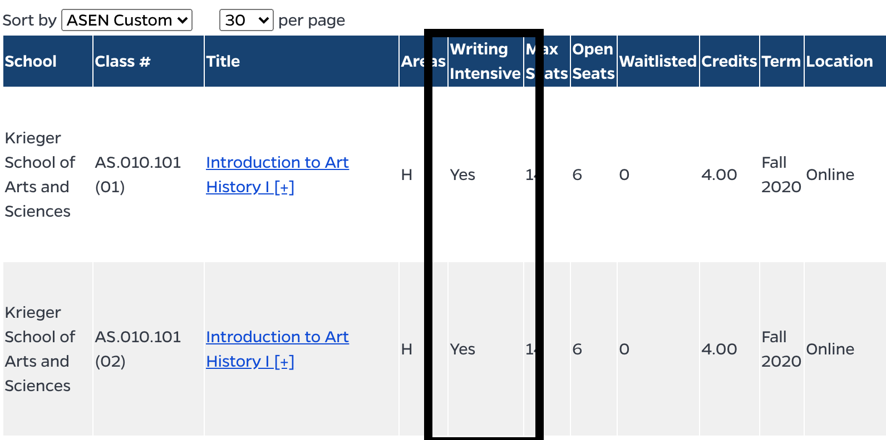 
### Task 2: Finding Classes on Certain Times and Days
The subject was asked to return back to main page and then asked to find classes that only occured on Tuesday and Thrusday at 11-1. I was surprised even if the user saw the advanced search tab, he chose to do a "empty" search and then navigate to the side panel to filter by the days. I asked him why that was and if he noticed that option in the advance search in the first place and he said he didn't remember having that option. He then clicked on the days and selected "on exact days". He however could not figure out how to look at specific times. He went back to the main search page and clicked on advanced search. There he saw there were choices to choose both days and time and clicked on that.

_Key Takeaways_
- The fact Class Search doesn't have a time filter once you click search makes it tedious as you have to go back. 
- Its important the search doesn't have too many options at first as then the user will not remember everything
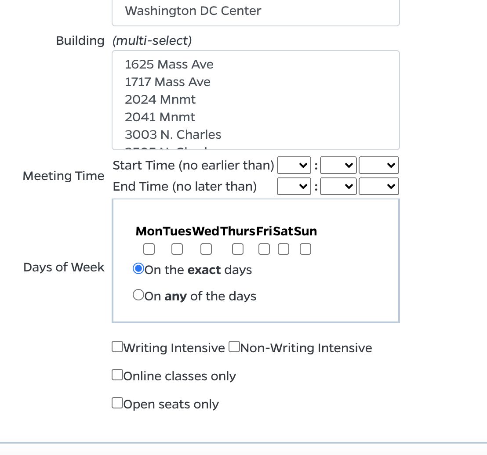 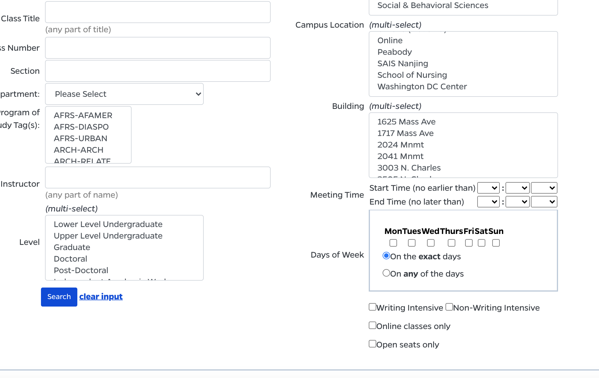 

### Task 3: Finding Classes in the Applied Math Department
The subject was asked to return back to main page and then asked to find classes offered by the Applied Math Department(as that one of my two majors). The subject went to the "Department" dropdown. The subject initially got stuck as the departments were listed by AS then EN so the Applied Math Department wasn't at the top. Once he scrolled down he found it and clicked search. 

_Key Takeaways_
- This was something that was meant to be a baseline , however it shows how important it is to sort based on the user's intuition 
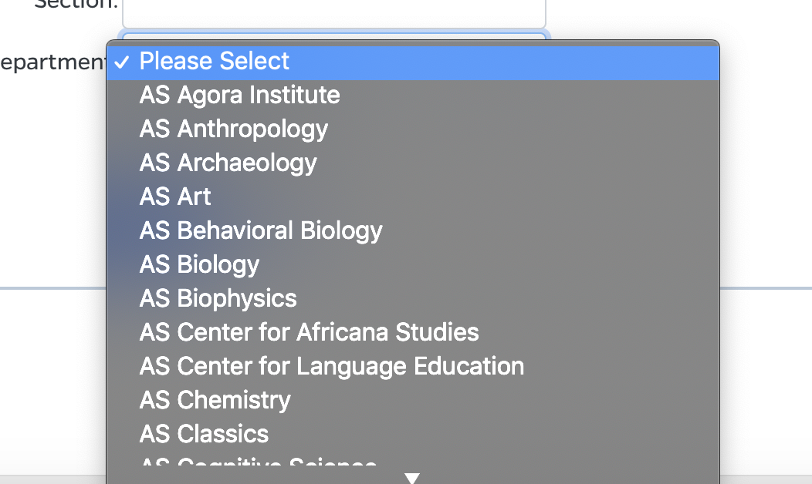  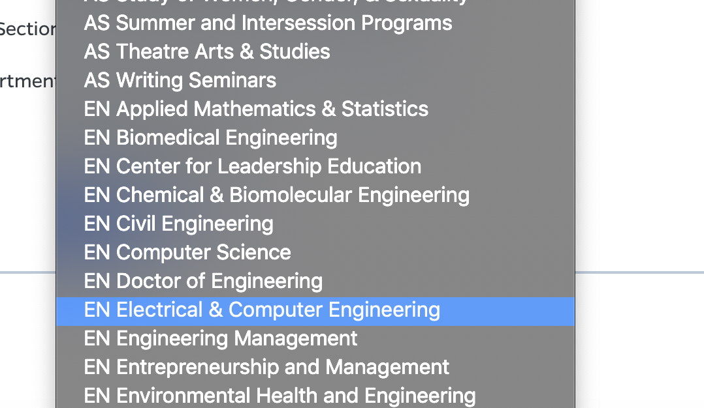

### Task 4: Finding Classes Including Topics about the Civil War
Finally the user one more time to to main page and then asked to find classes that discuss the Civil War. The subject first tried to find classes that had "Civil War" in the name. However no classes appeared so he went back. After seeing no other type of search includes a description based search, he said he remembered that there was a History Department so he searched with that. He then began reading every single description on the first 2 pages until he found a class about the Civil Rights Movement and argued that could contain information about the Civil War. He also commented "I hope your advisors know what different classes are about".

_Key Takeaways_
- Class Search is limted in terms of its discoverability and if students want to find class about specific topics, they would need to read many descriptions before they can find classes they want. This is not ideal and takes away precious time. 
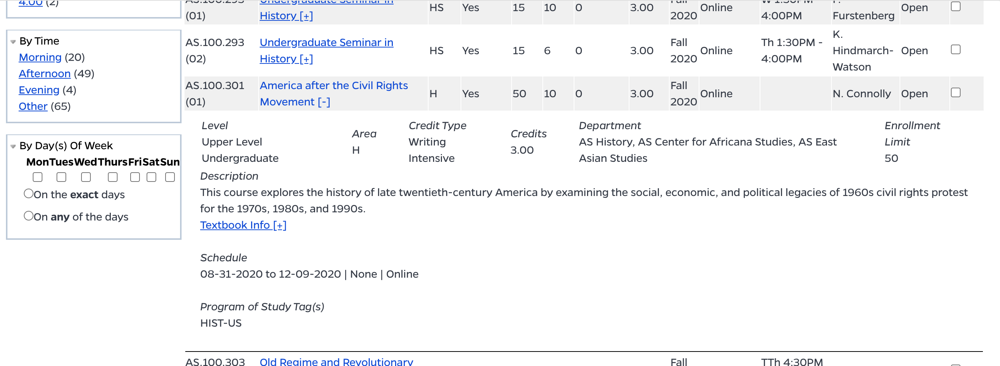

### One Additional Discovery:
As we were looking at classes, one more thing the subject mentioned was when he was looking at the classes, he was annoyed that the classes were ordered by class number and could not be ordered by something like open seats. From his experience of class registration, he knew that as classes that have fewer seats are harder to get so he was indavertenly looking for larger class sizes so he make sure he can actually get the class. 

## Sequential Model 
Note I used Miro to make my models so I apologize for having them a bit horizontal.
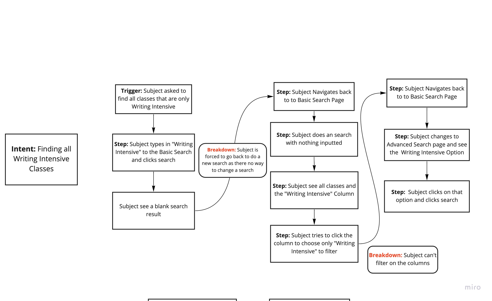
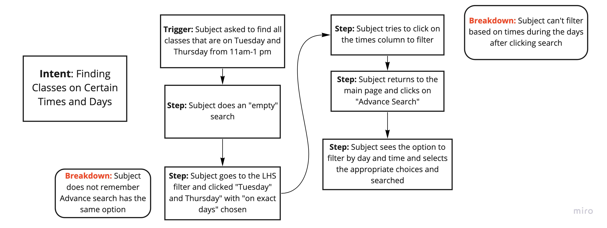
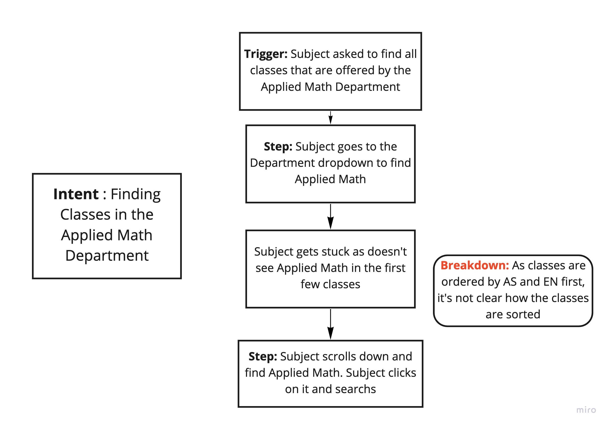
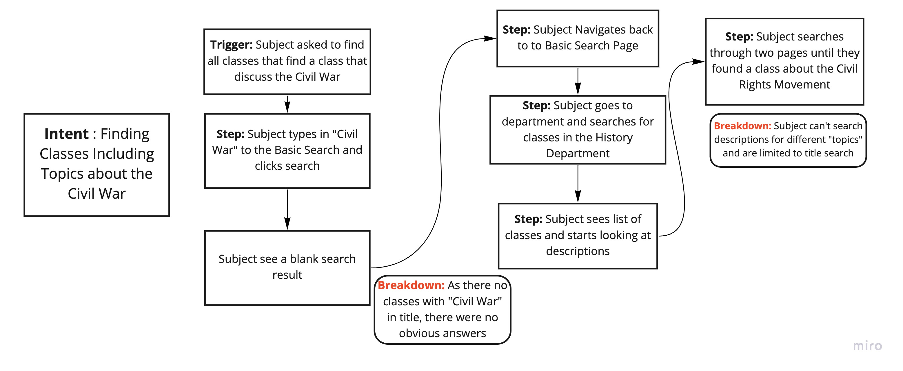

## "Paper-based" prototype
### Improvements
- Allowed users to do a new search without needing go back to the main page
- Moved certains filters that are important to the basic filter
- Added a "Description" search so people can searcg topics
- Reduced the three different searches to one "basic" search. I then moved the additional functionality search to once you've done search
- Cleaned up the search output and included less important information in the main description

Here is the link to the powerpoint to the "paper"-prototype: [Link](https://github.com/adalmia96/adalmia96.github.io/blob/master/HCI/Paper_prototype.pptx)
Here is a video explaining my prototype and how it works (not as search contains many features, I've focused on implementing based on the tasks I've asked only)
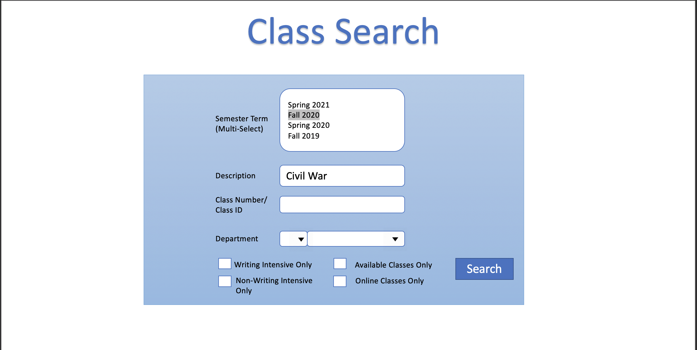

## "Paper-based" evaluation
_Note once again for privacy I will simply write down the results_
### Task 1: Finding Only Writing Intensive Classes
The subject was asked to navigate to the the "Class Search" tab. As there are few classes in Spring 2021, the subject was asked to click on Fall 2021. The subject was then asked to search for writing intensive classes only. The subject clicked on the "Writing Intensive" option and the clicked search.

_Final result_
- By creating a simple check with everything on one main search page, the subject easilt completed the task

### Task 2: Finding Classes on Certain Times and Days
The subject was asked to return back to main page and then asked to find classes that only occured on Tuesday and Thrusday at 11-1. The subject did an "empty search" and the saw on the left hand side the options to filter by Day and time. The subject then clicked down on the days and selected bith Tuesday and Thursday. Then the user selected "11:00 am" for start and then "1:00 PM" for end. The subject initially waited for it to auto filter but when nothing changed, the user clicked search and then all the correct classes appearred. 

_Final result_
- The user was able to easily filter based on days and exact times. However the user did say it was cumbersome to select everything so further investigation that will be good
- While it was easy for the user selects the correct options, the fact that clicking search after wasn't clear is another point to fix. (if I could do multiple iterations)

### Task 3: Finding Classes in the Applied Math Department
The subject was asked to return back to main page and then asked to find classes offered by the Applied Math Department. The subject went to the "Department" dropdown for the department nane. The subject sees Applied Math Department, clicks on it and then searches.

_Final result_
- By spliting school and department, made the search easier and intuitive

### Task 4: Finding Classes Including Topics about the Civil War
Finally the user one more time to to main page and then asked to find classes that discuss the Civil War. The subject typed in "Civil War" into the the description tab (he did have to ask what it meant though)and then clicked search. 
_Final result_
- While the addition made this task easy, it important also realize as this is new, it might need an explanation blurb next to it.

## Conclusion
I was able to make a better experience for class search for the tasks I've assigned making them easier and faster to do for the most part. With more iterations, I would have improved what I've mentioned and tried to delve deeper to the description tab. Please let me know what you think and any comments/questions you have!

